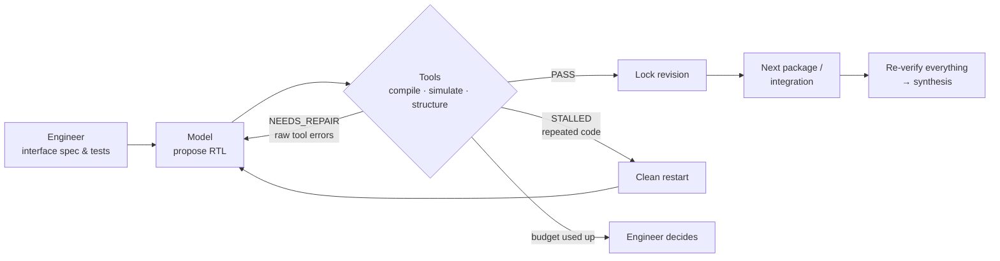

  

<h1 align="center">RTLoop · Results</h1>

  <b>Bring AI into IC design. Let the tools be the judge.</b> 
  <a href="https://rtloop.com">rtloop.com</a> · <a href="README.zh-TW.md">繁體中文</a> · <a href="mailto:boss@rtloop.com">boss@rtloop.com</a>

---

> **This is a results showcase, not the start of the project.**
> RTLoop's flow has been developed since **August 8, 2026** in a private repository: **813 commits and 68 dated result reports** as of October 2, 2026. The flow source, design kits and research notes stay private because they are our IP. This repository publishes what that work produced.

  
   
  SHA-256 / APB digital core: metal layers read back from the delivered GDS. SkyWater SKY130HD, 957 × 957 µm, 100 ns clock, 17/17 acceptance conditions (2026-09-09). A human-led run combining several models.

## Development at a glance

| Private development repository | |
| --- | --- |
| First commit | 2026-08-08 |
| Commits (to 2026-10-02) | 813 |
| Dated result reports | 68, from 2026-08-28 to 2026-10-01 |
| Source files · test files | 469 · 517 |
| Designs in the benchmark set | GCD · SPI · UART TX · AES-128 / APB · SHA-256 / APB · RV32I single-cycle · RV32I 5-stage pipeline |

## Timeline

| Date | Milestone |
| --- | --- |
| 2026-06-05 | RTLoop founded in Taiwan |
| 2026-08-08 | Development repository started |
| 2026-08-28 | First SKY130HD baseline (GCD) through the native physical flow |
| 2026-09-06 | Low-cost model capability baseline and feedback-repair experiments on GCD |
| 2026-09-07 | **AES-128 / APB taken to GDS, 17/17** (human-led, several models). SPI run end to end by a user through the browser workbench |
| 2026-09-09 | **SHA-256 / APB taken to GDS, 17/17** (human-led, several models; the layout above) |
| 2026-09-26 | Low-cost model benchmark on the SHA-256 core, 10 blank starts per arm |
| 2026-09-30 | **RV32I single-cycle from blank RTL: 10/10** with an auto-generated decomposition, versus 0/10 when everything is asked at once (Fisher p = 0.0001) |
| 2026-10-01 | **RV32I 5-stage pipeline: 3/10 → 10/10** after splitting the core into stage modules (Fisher p = 0.003) |

## What the flow does

RTLoop helps IC design teams adopt AI without trusting it blindly. In our verification loop, a low-cost model writes RTL one module at a time, and simulation, structural checks and synthesis decide what passes. Failures go back to the model as raw tool errors, within a fixed call and cost budget; if a module still fails, it stops and an engineer decides.

The loop is model-agnostic: the same gates judge every model, and a step beyond a low-cost model, such as a bus interface, can go to a stronger one under the same gates and budgets.

- **What the model sees:** the interface spec of its module, verified dependencies (read-only), its own previous version, raw tool output from the last failure, and the repair history of the package.
- **What it can't do:** edit tests or other modules, declare its own success, exceed call or cost budgets, or use latches, `initial` blocks or system tasks.
- **Testing the tests:** the loop only guarantees that RTL passes your tests, so tests are first run against reference RTL and then against seeded bugs. On the RV32I pipeline, all 22 seeded bugs were caught.

## Results

In every run in this table, one low-cost model wrote every module from an empty file. Our engineers wrote the interface specs, tests and decomposition plans.

| Design | Modules | Passed | Cost / pass | Time / pass | Fmax | Area |
| --- | ---: | ---: | ---: | ---: | ---: | ---: |
| gcd8 (8-bit GCD engine) | 2 | 8/8 | $0.0002–0.0006 | 26–63 s | 310–328 MHz | 1,640–1,724 µm² |
| RV32I single-cycle | 7 | 10/10 | $0.0063 | ≈ 8 min | 115.1 MHz | 68,212 µm² |
| RV32I 5-stage pipeline | 13 | 10/10 | $0.0081 | ≈ 11 min | 177.9 MHz | 85,030 µm² |
| SHA-256 core | 5 | 10/10* | $0.0052 | — | — | — |
| AES core (one architecture note added by an engineer; 0/8 without it) | 6 | 8/10 | $0.0143 | ≈ 12 min | — | — |

**Model-written vs hand-written RTL.** The split pipeline reached a median Fmax of 177.9 MHz against 183.3 MHz for our hand-written reference RTL, with 85,030 vs 84,361 µm² of area. The single-cycle core beat its reference: 115.1 vs 105.2 MHz.

\*SHA-256: latest round; the previous plan scored 6/10 and 9/10 in two rounds. RV32I is the base integer subset (FENCE, ECALL and CSR treated as no-ops), checked with our own testbenches rather than the official riscv-tests; memories sit outside the core. Fmax and area come from ORFS synthesis and OpenSTA on SkyWater SKY130HD before placement, with Fmax = 1000 / (clock period − worst setup slack); medians where several runs exist. Costs are model API costs only and exclude engineering time. These are engineering estimates from September–October 2026, not signoff and not a formal model qualification.

**Scope today:** synthesizable Verilog-2005 with a single clock, simulated with Icarus Verilog and synthesized with Yosys and OpenROAD on SkyWater SKY130.

### Decomposition decides success

Same pipeline spec, same low-cost model, 10 runs each (Fisher p = 0.003):

| | Whole core in one package | Split into stage modules |
| --- | ---: | ---: |
| Runs passed | 3/10 | **10/10** |
| Model cost per pass | $0.074 | **$0.0081** |
| Median time per pass | 30 min | **11 min** |
| 32k output-token overruns | 51 | **0** |

What changed: one small module per package; large sequential blocks split into one stage of logic plus its own registers; registers declared on the module interface and cleared on reset; tests that stop at the first mismatch and print every input, actual and expected value; interface specs that are exact to the cycle.

### Beyond synthesis: RTL to GDS

We have also taken three blocks with prepared physical profiles to GDS through a fixed, hash-locked SKY130 flow:

`synth → floorplan → place → cts → route → finish → DRC → LVS`

A run counts only when all 17 acceptance conditions hold, including setup and hold slack ≥ 0, zero DRC violations and an LVS match. Taken to GDS on SkyWater SKY130HD: **SPI**, **AES-128 / APB** and **SHA-256 / APB** (AES-128 and SHA-256 at a 100 ns clock).

These were earlier, human-led runs, unlike the low-cost-model results above: SPI's RTL is a low-cost model's refactor of reference RTL, while AES-128 and SHA-256 combined several models, with stronger ones for the bus interface and integration. RV32I and the other designs in the table stop at synthesis today. All three are digital-core layouts on an open PDK; pad ring, packaging and tape-out signoff are out of scope.

### Evidence in this repository

Excerpts of real outputs from the runs above, taken from our run records:

| File | What it is |
| --- | --- |
| [`evidence/sha256-apb-metal.png`](evidence/sha256-apb-metal.png) | Metal layers of the SHA-256 / APB core, read back from the delivered GDS |
| [`evidence/rv32i-pipe-v2-run-A01.log`](evidence/rv32i-pipe-v2-run-A01.log) | Progress log of one 5-stage pipeline run: 13 packages, 20 calls, 934.5 s |
| [`evidence/rv32i-pipe-v2-scoreboard.json`](evidence/rv32i-pipe-v2-scoreboard.json) | Benchmark scoreboard for 10 blank starts of the split pipeline |
| [`evidence/gcd8-synthesis-result.json`](evidence/gcd8-synthesis-result.json) | Synthesis result of one gcd8 run |

## You control what leaves

- **Verification stays local.** Simulation, structural checks, synthesis and the physical flow run on your machines. Reference RTL, testbenches, netlists and layouts never leave.
- **Minimum context per call.** A request carries one package's interface spec, the RTL of its verified dependencies, its previous version and tool feedback. Nothing else.
- **One pinned provider.** Today, model calls go to one pinned provider, with fallback routing off and data collection denied.
- **Every call on record.** Each request and response is stored with the project for audit. API keys live only in the subprocess that calls the model, never in logs, reports or Git.

## What we offer

| | |
| --- | --- |
| **AI adoption consulting** | Flow assessment and adoption roadmap · specs and testbenches written for AI · model selection and cost control · IP-aware deployment · hands-on training for your engineers |
| **Turnkey blocks** | Design kit (interface specs, testbenches, mutation-test report) · decomposition plan and the accepted RTL of each module, with digests · an HTML report of every model call and its cost · synthesis results (timing, area, power, netlist, SDC) |

Every engagement starts with a pilot on one real block, measured by pass rate, cost and time.

## Built on

Icarus Verilog · Yosys · OpenROAD · OpenSTA · OpenROAD-flow-scripts · KLayout · SkyWater SKY130

## Team

RTLoop was founded in Taiwan on June 5, 2026. Our 10 members include graduate students in IC design and AI from the Department of Electrical Engineering and the Department of Computer Science and Information Engineering at National Taiwan University of Science and Technology (NTUST). We track AI-for-EDA research and test new ideas on our own benchmarks before relying on them.

## In this repository

| Path | Contents |
| --- | --- |
| [`evidence/`](evidence/) | Excerpts of real outputs from our runs |
| [`site/`](site/) | Source of [rtloop.com](https://rtloop.com): `src/index.html` is the bilingual source, `build.py` writes the English and Chinese pages to `public/` |
| [`assets/`](assets/) | Logo |

Detailed evidence from the private repository is available to clients and program reviewers on request.

## Contact

[boss@rtloop.com](mailto:boss@rtloop.com) · [rtloop.com](https://rtloop.com)

---

© 2026 RTLoop. All rights reserved.
