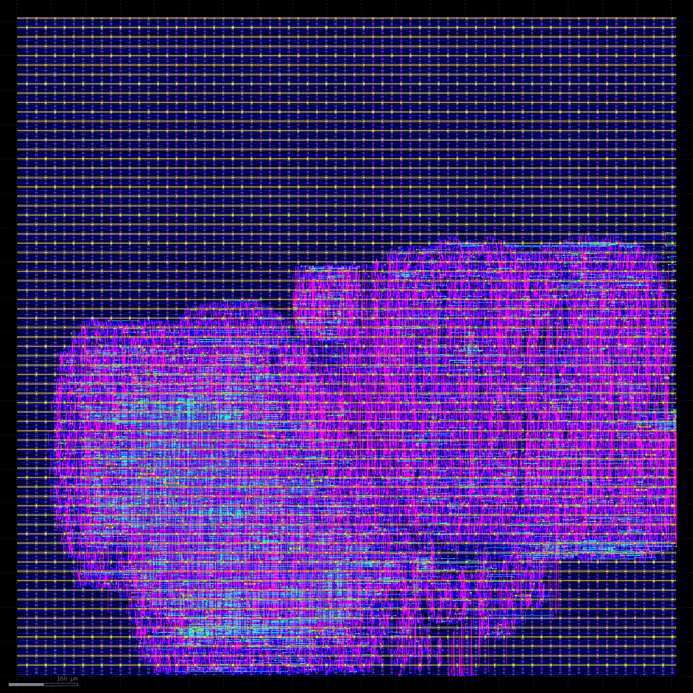
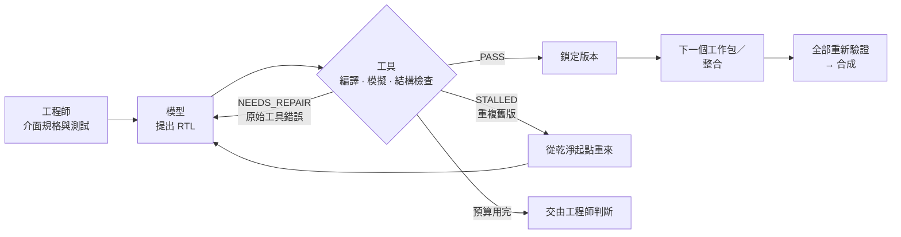

  

<h1 align="center">RTLoop · 成果展示</h1>

  <b>把 AI 帶進 IC 設計，讓工具當裁判。</b> 
  <a href="https://rtloop.com/zh/">rtloop.com</a> · <a href="README.md">English</a> · <a href="mailto:boss@rtloop.com">boss@rtloop.com</a>

---

> **這裡是成果展示，不是專案的起點。**
> RTLoop 的流程自 **2026 年 8 月 8 日**起在私有 repo 中開發，截至 2026 年 10 月 2 日共有 **813 個 commit、68 份附日期的實驗結果報告**。流程原始碼、設計套件與研究筆記屬於我們的智慧財產，因此維持不公開；這個 repo 發表的是這些工作的成果。

  
   
  SHA-256／APB 數位核心：從交付的 GDS 讀回的金屬層。SkyWater SKY130HD，957 × 957 µm，時脈週期 100 ns，17 項驗收條件全數通過（2026-09-09）。此案例由人主導、混用多個模型完成。

## 開發概況

| 私有開發 repo | |
| --- | --- |
| 第一個 commit | 2026-08-08 |
| commit 數（至 2026-10-02） | 813 |
| 附日期的實驗結果報告 | 68 份，2026-08-28 至 2026-10-01 |
| 原始碼檔 · 測試檔 | 469 · 517 |
| 基準測試設計 | GCD · SPI · UART TX · AES-128／APB · SHA-256／APB · RV32I 單週期 · RV32I 5 級管線 |

## 時間軸

| 日期 | 里程碑 |
| --- | --- |
| 2026-06-05 | RTLoop 於台灣成立 |
| 2026-08-08 | 開發 repo 啟動 |
| 2026-08-28 | 第一個 SKY130HD 基準（GCD）跑完原生實體流程 |
| 2026-09-06 | 在 GCD 上建立低成本模型的能力基準，並進行回饋修復實驗 |
| 2026-09-07 | **AES-128／APB 完成到 GDS，17 項條件全數通過**（人主導、混用多個模型）。使用者透過瀏覽器工作台完整跑完 SPI |
| 2026-09-09 | **SHA-256／APB 完成到 GDS，17 項條件全數通過**（人主導、混用多個模型；即上方佈局圖） |
| 2026-09-26 | 在 SHA-256 核心上進行低成本模型基準測試，每組 10 次空白起跑 |
| 2026-09-30 | **RV32I 單週期從空白 RTL 達成 10/10**（自動產生的拆分計畫），一次全部交代則為 0/10（Fisher p = 0.0001） |
| 2026-10-01 | **RV32I 5 級管線拆成階段模組後，從 3/10 提升到 10/10**（Fisher p = 0.003） |

## 這套流程在做什麼

RTLoop 協助 IC 設計團隊導入 AI，但不盲目相信 AI。在我們的驗證迴圈裡，低成本模型一次只寫一個模組，由模擬、結構檢查與合成決定能不能通過；沒通過時，原始的工具錯誤會回饋給模型，在固定的呼叫次數與費用預算內重試，仍不通過就停下，交由工程師判斷。

這個迴圈不綁定特定模型：同一套關卡評判每個模型；低成本模型做不到的步驟（例如匯流排介面），可以改用較強的模型，同樣受關卡與預算約束。

- **模型會看到：** 自己模組的介面規格、已驗證且唯讀的相依模組、自己的上一版、上次失敗的原始工具輸出，以及這個工作包的修復歷史。
- **模型不能：** 修改測試或其他模組、自己宣布成功、超出呼叫次數或費用預算，或使用 latch、`initial` 區塊與系統任務。
- **檢驗測試本身：** 驗證迴圈只能保證 RTL 通過您給的測試，所以測試會先對參考 RTL 執行，再植入錯誤檢驗。RV32I 管線植入的 22 種錯誤全數被擋下。

## 實測結果

表中每一次執行，每個模組都由同一個低成本模型從空白檔案寫起；介面規格、測試與拆分計畫由我們的工程師撰寫。

| 設計 | 模組數 | 通過 | 每次成功費用 | 每次成功時間 | Fmax | 面積 |
| --- | ---: | ---: | ---: | ---: | ---: | ---: |
| gcd8（8 位元最大公因數引擎） | 2 | 8/8 | $0.0002–0.0006 | 26–63 秒 | 310–328 MHz | 1,640–1,724 µm² |
| RV32I 單週期 | 7 | 10/10 | $0.0063 | 約 8 分鐘 | 115.1 MHz | 68,212 µm² |
| RV32I 5 級管線 | 13 | 10/10 | $0.0081 | 約 11 分鐘 | 177.9 MHz | 85,030 µm² |
| SHA-256 核心 | 5 | 10/10* | $0.0052 | — | — | — |
| AES 核心（工程師補一句架構說明；未補時 0/8） | 6 | 8/10 | $0.0143 | 約 12 分鐘 | — | — |

**模型寫的 RTL 與人工撰寫的參考 RTL 比較：** 拆分後的管線 Fmax 中位數為 177.9 MHz，我們人工撰寫的參考 RTL 為 183.3 MHz，面積為 85,030 對 84,361 µm²；單週期核心甚至超越參考 RTL（115.1 對 105.2 MHz）。

\*SHA-256 為最新一輪結果，前一版計畫兩輪分別為 6/10 與 9/10。RV32I 為整數基本指令子集（FENCE、ECALL、CSR 視為 no-op），以自建測試平台驗證，並非官方 riscv-tests；記憶體在核心之外。Fmax 與面積來自 SkyWater SKY130HD 上的 ORFS 合成與 OpenSTA、未經佈局繞線，Fmax = 1000 /（時脈週期 − 最差 setup slack）；有多次執行時取中位數。費用只計模型 API，不含工程人力。以上為 2026 年 9–10 月的工程估計值，不是 signoff，也不是正式的模型認證。

**目前範圍：** 單一時脈的可合成 Verilog-2005，以 Icarus Verilog 模擬，並在 SkyWater SKY130 上以 Yosys 與 OpenROAD 合成。

### 拆分方式決定成敗

同一份管線規格、同一個低成本模型，各執行 10 次（Fisher p = 0.003）：

| | 核心整包 | 拆成階段模組 |
| --- | ---: | ---: |
| 通過次數 | 3/10 | **10/10** |
| 每次成功的模型費用 | $0.074 | **$0.0081** |
| 每次成功時間中位數 | 30 分鐘 | **11 分鐘** |
| 超過 32k 輸出 token 上限 | 51 | **0** |

我們做的調整：一個工作包只寫一個小模組；大型時序模組拆成「一級組合邏輯＋該級暫存器」；暫存器直接宣告在模組介面上並在 reset 時清零；測試在第一個錯誤就停，並印出所有輸入、實際值與預期值；介面規格精確到每個時脈週期。

### 不只合成：從 RTL 到 GDS

我們也把三個具備實體流程設定的模組，用固定、雜湊鎖定的 SKY130 流程做到 GDS：

`synth → floorplan → place → cts → route → finish → DRC → LVS`

只有 17 項驗收條件全部成立才算通過，包括 setup／hold slack ≥ 0、DRC 零違規，以及 LVS 比對一致。已在 SkyWater SKY130HD 上完成到 GDS：**SPI**、**AES-128／APB**、**SHA-256／APB**（AES-128 與 SHA-256 的時脈週期為 100 ns）。

這三個案例是較早期、由人主導的執行，和上方低成本模型的結果不同：SPI 的 RTL 是低成本模型依參考 RTL 重構的版本；AES-128 與 SHA-256 混用多個模型，匯流排介面與整合使用較強的模型。表中的 RV32I 等設計目前只做到合成。以上皆為開源 PDK 上的數位核心佈局，pad ring、封裝與下線（tape-out）簽核不在範圍內。

### 本 repo 的證據檔

取自實際執行紀錄的節錄：

| 檔案 | 內容 |
| --- | --- |
| [`evidence/sha256-apb-metal.png`](evidence/sha256-apb-metal.png) | SHA-256／APB 核心的金屬層，從交付的 GDS 讀回 |
| [`evidence/rv32i-pipe-v2-run-A01.log`](evidence/rv32i-pipe-v2-run-A01.log) | 一次 5 級管線執行的進度紀錄：13 個工作包、20 次呼叫、934.5 秒 |
| [`evidence/rv32i-pipe-v2-scoreboard.json`](evidence/rv32i-pipe-v2-scoreboard.json) | 拆分版管線 10 次空白起跑的基準測試統計 |
| [`evidence/gcd8-synthesis-result.json`](evidence/gcd8-synthesis-result.json) | 一次 gcd8 執行的合成結果 |

## 送出什麼，由您掌握

- **驗證在本機執行：** 模擬、結構檢查、合成與實體流程都在您的機器上執行；參考 RTL、測試平台、網表與佈局都不會送出。
- **每次只送必要內容：** 每次請求只帶一個工作包的介面規格、已驗證相依模組的 RTL、它的上一版與工具回饋，沒有其他內容。
- **指定單一供應端：** 目前模型呼叫只送往指定的單一供應端，不允許備援路由，並拒絕資料收集。
- **每次呼叫都有紀錄：** 每次請求與回覆都和專案一起保存，可供稽核。API 金鑰只存在呼叫模型的子行程中，不會出現在紀錄、報告或 Git 裡。

## 服務項目

| | |
| --- | --- |
| **IC 設計 AI 導入顧問** | 流程評估與導入藍圖 · 為 AI 撰寫的規格與測試 · 模型選擇與成本控管 · 顧及 IP 的部署方式 · 工程師實作訓練 |
| **委託開發** | 設計套件（介面規格、測試平台、變異測試報告）· 拆分計畫，以及每個模組驗收通過的 RTL（附雜湊值）· 每次模型呼叫與費用的 HTML 報告 · 合成結果（時序、面積、功耗、網表、SDC） |

每個合作都從一個真實模組的試行開始，以通過率、成本與時間衡量。

## 使用的工具

Icarus Verilog · Yosys · OpenROAD · OpenSTA · OpenROAD-flow-scripts · KLayout · SkyWater SKY130

## 團隊

RTLoop 於 2026 年 6 月 5 日在台灣成立。10 位成員中包括國立臺灣科技大學電機工程系與資訊工程系的 IC 設計與 AI 研究生。我們持續追蹤 AI for EDA 研究，新做法都先在自己的基準測試上驗證才採用。

## 本 repo 內容

| 路徑 | 內容 |
| --- | --- |
| [`evidence/`](evidence/) | 實際執行的輸出節錄 |
| [`site/`](site/) | [rtloop.com](https://rtloop.com/zh/) 的原始碼：`src/index.html` 是中英雙語原始檔，`build.py` 會產生英文與中文頁面到 `public/` |
| [`assets/`](assets/) | 標誌 |

客戶與方案審核者可來信索取私有 repo 中更詳細的證據。

## 聯絡

[boss@rtloop.com](mailto:boss@rtloop.com) · [rtloop.com](https://rtloop.com/zh/)

---

© 2026 RTLoop. All rights reserved.
